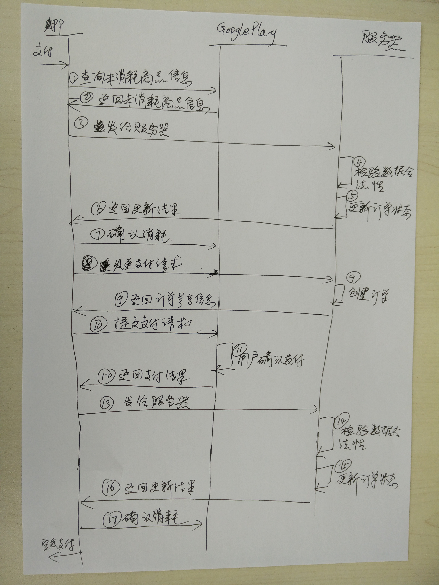

###Google play 支付流程

参考代码：android-sdk\extras\google\play_billing\samples\TrivialDrive\src\com\example\android\trivialdrivesample\util\IabHelper.java

支付流程如下图所示：

流程说明：

1. 未确认消耗的商品（参考：IabHelper.queryPurchases()方法）；
2. 获得未确认消耗的商品信息；
3. 将商品信息发送给服器（把Purchase中的getOriginalJson()和getSignature()两项数据发给服务器就可以了）；
4. 服务器检查数据的合法性（参考IabHelper中的：Security.verifyPurchase(mSignatureBase64, purchaseData, dataSignature)）；
5. 更新订单状态（如果订单已经是支付的就不需要更新了）
6. 返回订单状态
7. 确认消耗（只有当服务器返回的订单状态，是支付成功才进行确认消耗，否则不进行确认消耗操作）
8. 这步才开始正式的支付操作，前面的操都是为了解决丢单的问题，进行补更数据。发送创建订单请求给服务器；
9. 返回订单号等信息
10. 提交支付请求到google play; 
11. 用户完成确认支付；
12. 返回支付结果信息；
13. 发送支付信息给服务器（与第三步相同）
14. 与第4步相同
15. 与第5步相同
16. 与第6步相同
17. 与第7步相同

以上流程把支付和补丢单的流程混在一起了,显得有点长，大家可以根据自己的情况，做些优化，这里只是给出如果防止丢单的解决思路。

大家不要直接使用IabHelper.java中的代码，最好是根据自己重新开发。

这个流程也让我想到在“分布式系统”中，达到数据最终一致性的问题。这其实也一个不错的方案。避免了“分布式事务”，同时也能到过数据最终一致性。