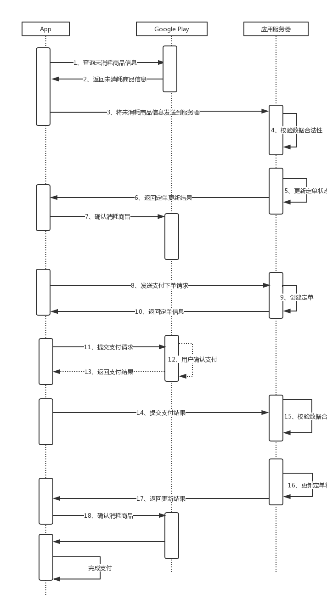

#Google play 支付流程（App内购）

参考代码：android-sdk\extras\google\play_billing\samples\TrivialDrive\src\com\example\android\trivialdrivesample\util\IabHelper.java

###Google play支付的丢单原因：

丢单因为主要是因为支付操作都是在客户端完成的，非常容易受到网络等因素的影响，造成互相通信失败。比如：用户确认支付后，把请求提交给google play,可能因为网络不好造成，客户端没有接收到支付成功能消息（但有可能已经支付成功了，只是没收到支付结果而已）；还有客户端把支付结果通知给服务器时，也有可能因丢包等问题造成通知失败。

###支付流程如下图所示：

###流程说明：

1. 查询未确认消耗的商品（参考：IabHelper.queryPurchases()方法）；
2. 获得未确认消耗的商品信息；
3. 将未确认消耗的商品信息发送给服器（把Purchase中的getOriginalJson()和getSignature()两项数据发给服务器就可以了）；
4. 服务器检查数据的合法性（参考IabHelper中的：Security.verifyPurchase(mSignatureBase64, purchaseData, dataSignature)）；
5. 更新定单状态（如果定单已经是“支付成功”的则不需要更新了）
6. 返回“定单状态”
7. 确认消耗（只有当服务器返回的定单状态是“支付成功”的才进行确认消耗，否则不进行确认消耗操作。确认消耗操作实现参考：IabHelper.consume）
8. 发送创建定单请求给服务器；

    ***注意***：这步才开始正式的支付操作，前面的操都是为了解决丢单的问题，进行补更操作。
9. 创建定单；
10. 返回定单号等信息
11. 提交支付请求到google play(参考：IabHelper.launchPurchaseFlow); 
12. 用户完成确认支付；
13. 返回支付结果信息；
14. 发送支付信息给服务器（与第3步相同）
15. 与第4步相同
16. 与第5步相同
17. 与第6步相同
18. 与第7步相同

如果从11步到18步，这个期间出现 ***网络故障***、***设备不可用***、***服务器故障***等问题时，就会出现丢单的情况；
如果第18步没在成功执行，则会造成还有未确认消耗的商品，那么在第11步操作时就会报错。所以1到7补更数据的操作是非常重要的，不然又可能会造成用户再也无法购买，而造成用户流失。

以上流程把支付和补丢单的流程混在一起了,显得有点长，大家可以根据自己的情况，做些优化，这里只是给出如果防止丢单的解决思路。

大家不要直接使用IabHelper.java中的代码，最好是根据自己情况重新开发。

使用apple stroe 支付的流程和Google play流程其实是样的，也会有丢单的问题，解决思路也是一样。
每次支付时，查询交易队列中，是否还有未完成的交易，如果有则进行补更数据流程，最后进行“完成交易”操作。
获得到apple stroe 支付结果后，提交给服务器，只有当服务器定单状态为“支付成功”时，才进行“完成交易”操作。

为了保证数据的一致性，国内支付渠道都是通过服务器异步通知来实现，即:间隔一段时间发一次支付结果通知，直到通知成功为止。而google play和apple store没有提供服务器的异步通知功能，所以需要使用者自己来保证数据的一致性。